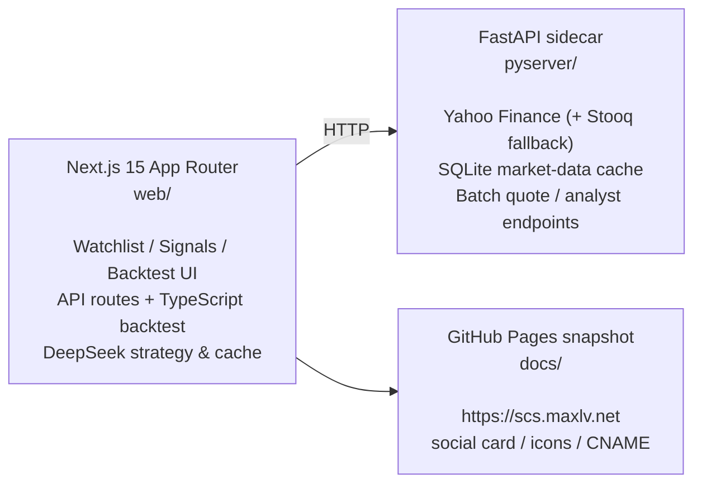

# Silicon Civilization Stocks — US Trading System

A thematic research & trading dashboard for the US market, focused on **silicon
civilization consumption stocks**: the compute, interconnect, cooling, power,
data centers, memory, semiconductor equipment & materials that AI infrastructure
continuously consumes in order to exist, expand, and iterate.

Static snapshot site: <https://scs.maxlv.net>

## Theme

"Silicon civilization consumption" is not humans buying AI products. It assumes
that once artificial intelligence forms a silicon-based civilization, it consumes
what it needs to run and expand. The system goes long the "sellers of shovels"
that feed this silicon civilization:

- Compute chips (GPUs/accelerators/CPUs), AI servers, cloud & data centers
- Optical modules, high-speed interconnect, high-speed PCB, HBM/memory
- Liquid cooling, power, clean energy & nuclear
- Semiconductor equipment, materials, foundry, and the broader manufacturing chain

## Features

- Thematic watchlist: US tickers grouped by sub-theme, stored in `web/data/universe.json`.
- Live quotes & price targets: pulls current price, valuation, analyst targets, and upside from a local Python sidecar.
- DeepSeek strategy signals: live signals page and a TypeScript backtest engine.
- Frontend loading UX: a progress bar while pulling quotes from pyserver; quote/analyst caching is centralized in pyserver's SQLite, so the browser keeps no cache.
- Static snapshot: generates the GitHub Pages site under `docs/`, including social card, icons, and custom domain.

## Architecture



## Data & caching

| Layer | Location | Purpose | TTL |
|---|---|---|---|
| Python market-data cache | `pyserver/cache.db` | klines, fundamentals, quotes, analyst data | layered TTL |
| DeepSeek response cache | `web` SQLite cache | LLM responses keyed by `sha256(prompt+model)` | 12h |
| Backtest signal cache | `web` SQLite cache | resolved historical rebalance signals | long-lived |

pyserver data-source strategy:

- `/klines`: Yahoo Finance daily history (split/dividend adjusted), with Stooq CSV as an automatic fallback.
- `/fundamental`: Yahoo Finance `.info` (trailing PE, P/B, market cap in $B, growth).
- `/analyst` & `/analysts`: Yahoo Finance recommendation trend + mean price target + forward EPS.
- `/spot` & `/spots`: Yahoo Finance `fast_info`; optional Finnhub or last-close fallback.

## Quick start

### 1. Start the Python sidecar

```bash
cd pyserver
cp env.example .env
# Optional: set FINNHUB_API_KEY / ALPHAVANTAGE_API_KEY in .env (the server runs key-free)
uv sync
uv run uvicorn main:app --port 8001 --reload
```

### 2. Start the Next.js web app

```bash
cd web
npm install
cp env.example.txt .env.local
# Set DEEPSEEK_API_KEY, DEEPSEEK_BASE_URL, PYSERVER_URL in .env.local
npm run dev
```

Open <http://localhost:3000>.

Example `web/.env.local`:

```bash
DEEPSEEK_API_KEY=sk-...
DEEPSEEK_MODEL=deepseek-v4-pro
DEEPSEEK_MODEL_BACKTEST=deepseek-v4-flash
DEEPSEEK_BASE_URL=https://api.deepseek.com
PYSERVER_URL=http://localhost:8001
```

## Static snapshot

The static site is published from `docs/`, with GitHub Pages custom domain
`scs.maxlv.net` configured in `docs/CNAME`.

Generate a snapshot:

```bash
cd web
npx tsx scripts/snapshot.ts
```

To refresh only the watchlist page (skip signals and backtest):

```bash
cd web
SNAPSHOT_SKIP_SIGNALS=1 SNAPSHOT_SKIP_BACKTEST=1 npx tsx scripts/snapshot.ts
```

Local preview:

```bash
python3 -m http.server 8765 --directory docs
```

## Directory layout

```
silicon-civilization-stock-trade-us/
├── docs/                      # GitHub Pages static snapshot, icons, social card, CNAME
├── pyserver/                  # FastAPI + Yahoo Finance sidecar
│   ├── main.py
│   ├── env.example
│   ├── pyproject.toml
│   └── uv.lock
└── web/                       # Next.js 15 App Router
    ├── app/
    │   ├── page.tsx
    │   ├── signals/page.tsx
    │   ├── backtest/page.tsx
    │   └── api/
    │       ├── analyst/batch/route.ts
    │       ├── spot/batch/route.ts
    │       └── backtest/route.ts
    ├── data/universe.json     # editable watchlist
    ├── lib/
    │   ├── universe.ts
    │   ├── pyserver.ts
    │   ├── deepseek.ts
    │   ├── backtest.ts
    │   └── cache.ts
    └── test/
```

## Development commands

| Purpose | Command |
|---|---|
| Start sidecar | `cd pyserver && uv run uvicorn main:app --port 8001 --reload` |
| Start web dev server | `cd web && npm run dev` |
| Type check | `cd web && ./node_modules/.bin/tsc --noEmit` |
| Unit tests | `cd web && npm test` |
| Production build | `cd web && npm run build` |
| Python syntax check | `python3 -m py_compile pyserver/main.py` |
| Refresh static snapshot | `cd web && npx tsx scripts/snapshot.ts` |

Do not run `npm run dev` and `npm run build` in the same workspace at once — the
`.next` artifacts can interfere. Stop the dev server before building.

Stop local services:

```bash
lsof -ti:3000,8001 | xargs kill
```

## Security & configuration

- Do not commit `.env`, `.env.local`, `cache.db`, `.cache/`, `.next/`, `node_modules/`, or any API key.
- Optional `FINNHUB_API_KEY` / `ALPHAVANTAGE_API_KEY` go only in `pyserver/.env`.
- `DEEPSEEK_API_KEY`, `DEEPSEEK_BASE_URL`, `PYSERVER_URL` go only in `web/.env.local`.
- Keep private server addresses, real tokens, and temporary debug URLs out of public docs and default config.

## Contributing

This repo requires linear history. Resolve conflicts with rebase or cherry-pick,
push rewritten branches with `--force-with-lease`; do not introduce merge commits.
